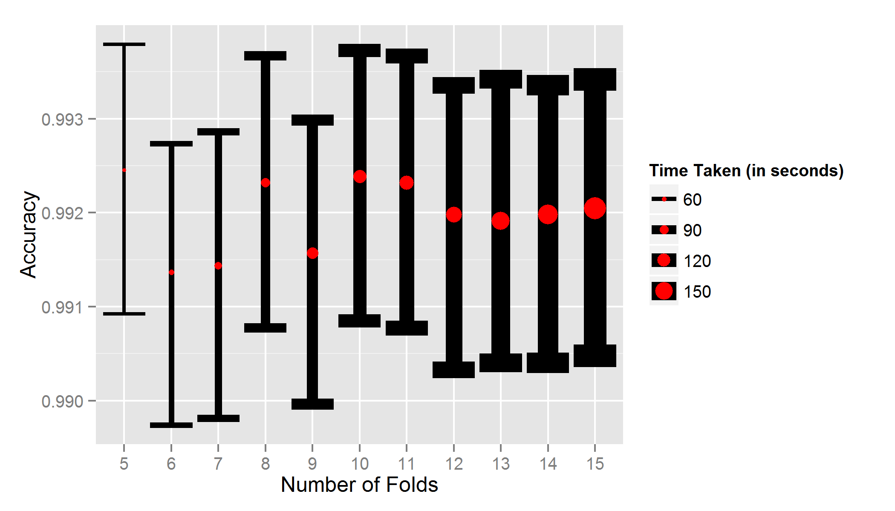

```{r, echo=4:6,results='hide',message=FALSE,warning=FALSE}
#sets the working directory
homedir<-file.path("c:","users","adaner","dropbox","school","stats",
                   "jhu_machlearn")
setwd(homedir)
#this 'auxiliary.R' file defines a couple of helper functions,
#loads libraries and sets the seed
source('auxiliary.R') 
```

#Loading and Cleaning the Data

The first thing I do is set aside a chunk of the training data. The purpose of this is to have a sample of data on which I can test the prediction model I build, before applying it to the data supplied by the course. Given the number of observations in the training dataset, I set aside a fairly large chunk (75%). In other words, I choose to build my model on only 25% of the training dataset, and I use the remaining 75% to evaluate my model. I do this in order to speed up processing time. Earlier attempts to fit models had floundered due to the size of the dataset I was using to train my model. If this had been a bad decision, it would have been revealed in the accuracy of the model I built; as it happens, I achieve a prediction accuracy of over 99%, which suggests that there is no deep reason to be concerned. 

```{r}
#load the training data
pmltrain<-read.csv('pml-training.csv')

#partition into subsets of training set (train_train, and train_test)
intrain<-createDataPartition(y=pmltrain$classe,p=0.25,list=F)
pmltrain_train<-pmltrain[intrain,]
pmltrain_test<-pmltrain[-intrain,] 
```

The training data that we have been supplied is messy. Even though I have very little idea which predictors are best suited to predicting the outcome variable of interest, given my lack of familiary with this field, we can be sure that variables that do not contain a lot of data are unlikely to be of much help. Visual inspection reveals several variables that fit this bill. (I also remove the several variables which are conceptually of no relevance: the observation ID, the timestamps, etc.)

```{r}
navars<-c()
blankvars<-c()
for (i in 1:ncol(pmltrain_train)) {
  if (sum(is.na(pmltrain_train[,i]))>1000) #more than 1000 NA's 
    navars<-append(navars,names(pmltrain_train)[i])
  if (sum(pmltrain_train[,i]=="",na.rm=T)>1000)
    blankvars<-append(blankvars,names(pmltrain_train)[i]) #more than 1000 blanks
}
#pick out vars that aren't largely NA and blank
notthesevars<-append(navars,blankvars) 
thesevars<-names(pmltrain_train)[which(!(names(pmltrain_train) %in% notthesevars))] 
#pull out outcome var from 'usefulvars', and drop the timestamp et al. 
notforprediction<-c("classe","X","raw_timestamp_part_1","raw_timestamp_part_2","cvtd_timestamp","new_window")
firstcutvars<-thesevars[-which(thesevars %in% notforprediction)] #firstcut of vars for my model
```

#A Decision Tree Model

This reduces the 160 potential predictors in the original training data to just 54. That said, 54 predictors is still a fairly large number for the Random Forest algorithm to handle. I ran out of patience waiting for my computer. Ideally, we would decide which subset of these 54 predictors is most useful based on some theory of human movement/kinetics. But I have no clue, in this domain. 

Instead, I proceed as follows. First, I use these 54 predictors in a simple decision tree model, using the `rpart` method. Second, I select the variables that this method deems important, and feed that subset into a Random Forest model.

To ensure that models aren't being overfit on even that subset of the training dataset being used to train the model, I use 5-fold cross validation. This is important. When I use `rpart` to generate a list of which variables are most important, a failure to employ some kind of cross-validation approach at the model-fitting stage could mean that the list of variables returned are 'overfit' to the subset of the training data. This would mean that they would be suboptimal for out-of-sample predictions, which is my ultimate aim here. 

```{r,results='hold',message=FALSE,warning=FALSE}
#most basic model. decision trees prediction model, 5-fold CV strategy
fivefold<-trainControl(method="repeatedcv",number=5)
fit_pml.rpart<-train(data=pmltrain_train,
                     makeformula(firstcutvars) #'makeformula' is custom function (see auxiliary.R)
                     ,method="rpart",trControl=fivefold) 
```

Note that the 5-fold cross-validation is done in the `train` function itself, in the course of choosing parameters for the final model. I also perform a separate, secondary form of cross-validation by subsetting the training dataset in the manner I did at the outset. The purpose of this is to produce a reliable estimate of my model's out-of-sample accuracy. The 75% of the training dataset that I set aside at the beginning simulates the out-of-sample error of the final model. The `feedback` function I use here (see auxiliary.R) is evaluating the predictions of my model on that subset. 

```{r}
#how did `rpart' do?
print(feedback(fit_pml.rpart)[[2]]) #'feedback' is custom function (see auxiliary.R)
```

#The Random Forest Model

The `rpart` method has woeful accuracy. But, as I said, it generates a fairly clear list of the most important predictors. In theory, this need not match the ideal set of predictors for a Random Forest model. But I assumed that there would not be too large a mismatch, which seems to have been vindicated by the estimated accuracy I obtained through this method. 

```{r,results='asis',message=FALSE,warning=FALSE}
#pick vars with importance rating from the rpart model
importantvars.rpart<-feedback(fit_pml.rpart)[[1]]$importance 
importantvars.rpart$var<-row.names(importantvars.rpart)

#pick only those vars with non-zero importance scores
rfvars<-importantvars.rpart$var[importantvars.rpart$Overall>0] 
print(rfvars)

#use these vars in a random forest model
fit_pml.rf5<-train(data=pmltrain_train,makeformula(rfvars),method="rf",trControl=fivefold)

#how did 'RF' do?
print(feedback(fit_pml.rf5)[[2]]) 
```

#How Many Folds Does It Take? 

One might wonder whether 5-fold cross-validation is preferable to alternatives (10-fold, 15-fold). My reading suggests that there is no science to this number. The obvious drawback to going any higher is that higher folds require more processing time. The lectures suggested that higher folds introduce less bias but more variance into estimates: whether this results in better predictions is not clear to me, a priori. 

For this reason, I thought it might be interesting to examine the relationship between the number of folds and the accuracy of the model before deciding on a final model. The following chunk of code runs a Random Forest model with the selected predictors with k-folds, as k goes from 5 to 15. I examine the relationship between accuracy (as estimated on the 75% of the training set left out), the number of folds, and the processing time. These are plotted in Figure 1. 

```{r,eval=FALSE}
accuracies<-c(); accuracies_lb<-c(); accuracies_ub<-c()
times<-c(); folds<-c()
for (i in 5:15) {
  print(paste0("Currently fitting RF with ",i," fold(s)"))
  st<-proc.time()
  currentfit_pml.rf<-train(data=pmltrain_train,makeformula(rfvars),method="rf",
        trControl=trainControl(method="repeatedcv",number=i)) 
  accuracies<-append(accuracies,feedback(currentfit_pml.rf)[[2]][1])  
  accuracies_lb<-append(accuracies_lb,feedback(currentfit_pml.rf)[[2]][2])  
  accuracies_ub<-append(accuracies_ub,feedback(currentfit_pml.rf)[[2]][3])  
  times<-append(times,(proc.time()-st)[1]) #append user time
  folds<-append(folds,i)
}

data<-data.frame(folds=factor(folds),times=as.numeric(times),
                 accuracies=accuracies,accuracies_lb=accuracies_lb,
                 accuracies_ub=accuracies_ub)

ggplot(data=data,aes(x=folds,y=accuracies,size=times,
                        ymin=accuracies_lb,ymax=accuracies_ub))+
  geom_errorbar()+geom_point(color="red")+
  xlab("Number of Folds")+ylab("Accuracy")+
  scale_size(name="Time Taken (in seconds)")
```
The figure below suggests, interestingly, that accuracy is not helped by increasing the number of folds.

On this basis, I opt for a 5-fold Random Forest model using the predictors highlighted by my earlier Decision Tree model. 


